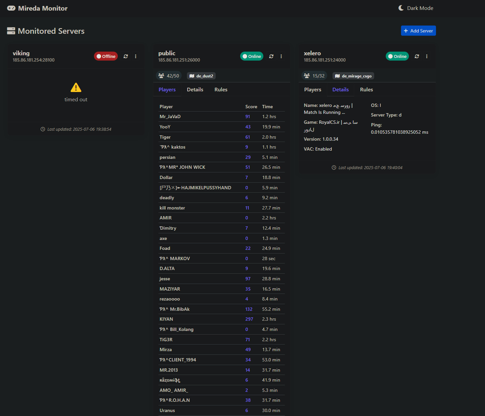

# Mireda Source Server Monitor

A modern, real-time web dashboard for monitoring Source engine game servers (CS2, CS:Source, CS:GO, Team Fortress 2, Garry's Mod, etc.). Built with Flask and Socket.IO for live updates.



## ✨ Features

- **Real-time Monitoring**: Live updates every 30 seconds via WebSocket
- **Modern UI**: Clean, responsive design with dark/light mode toggle
- **Server Details**: View server info, current players, and game rules
- **Multi-server Support**: Monitor unlimited servers simultaneously
- **Player Information**: Real-time player count, scores, and connection times
- **Server Rules**: Display custom server configurations and settings
- **Status Indicators**: Clear online/offline status with error reporting
- **Manual Refresh**: Force update individual servers on demand

## 🚀 Quick Start

### Prerequisites

- Python 3.7 or higher
- pip package manager

### Installation

1. **Clone the repository**
   ```bash
   git clone https://github.com/miredaw/sourceMonitor.git
   cd sourceMonitor
   ```

2. **Install dependencies**
   ```bash
   pip install -r requirements.txt
   ```

3. **Run the application**
   ```bash
   python app.py
   ```

4. **Access the dashboard**
   Open your browser and navigate to `http://localhost:4000`

## 📦 Dependencies

```
Flask==2.3.3
Flask-SocketIO==5.3.6
python-a2s==1.3.0
```

## 🎮 Supported Games

This monitor works with any Source engine game that supports the A2S protocol:

- **Counter-Strike 2**
- **Counter-Strike Source**
- **Counter-Strike: Global Offensive**
- **Team Fortress 2**
- **Garry's Mod**
- **Left 4 Dead 2**
- **Portal 2**
- **Day of Defeat: Source**
- **Half-Life 2: Deathmatch**
- And many more Source engine games!

## 🖥️ Usage

### Adding Servers

1. Click the **"Add Server"** button in the dashboard
2. Enter server details:
   - **Friendly Name**: A display name for your server
   - **Server Address**: IP address or hostname
   - **Server Port**: Port number (default: 27015)
3. Click **"Add Server"** to start monitoring

### Managing Servers

- **Refresh**: Click the refresh button to manually update a server
- **Remove**: Use the dropdown menu to remove servers from monitoring
- **View Details**: Switch between Players, Details, and Rules tabs

### Dashboard Features

- **Real-time Updates**: Server data refreshes automatically every 30 seconds
- **Dark/Light Mode**: Toggle between themes using the button in the navigation
- **Responsive Design**: Works on desktop, tablet, and mobile devices
- **Live Player Count**: See current and maximum player counts
- **Player Details**: View player names, scores, and connection times

## 🔧 Configuration

### Environment Variables

Set these environment variables for production deployment:

```bash
export SECRET_KEY="your-secret-key-here"
export FLASK_ENV="production"
```

### Custom Port

To run on a different port, modify the last line in `app.py`:

```python
socketio.run(app, debug=True, host='0.0.0.0', port=5000)  # Change port here
```

### Update Frequency

To change how often servers are queried, modify the sleep time in `app.py`:

```python
time.sleep(60)  # Update every 60 seconds instead of 30
```

## 🔒 Security Considerations

- The application stores server data in a local JSON file (`servers.json`)
- No authentication is built-in - consider adding authentication for production use
- Server queries are made from the backend, not exposing your monitoring setup
- Use environment variables for sensitive configuration in production

## 📝 License

This project is licensed under the MIT License - see the [LICENSE](LICENSE) file for details.

## 🐛 Troubleshooting

### Common Issues

**Server shows as offline but is actually online:**
- Check firewall settings on the game server
- Ensure the server is configured to respond to A2S queries
- Verify the correct IP address and port

**Application won't start:**
- Check that Python 3.7+ is installed
- Ensure all dependencies are installed correctly
- Verify port 4000 is available

**Players not showing:**
- Some servers may have player queries disabled
- Check server configuration for A2S settings

### Debug Mode

To enable debug logging, set the Flask environment:

```bash
export FLASK_ENV=development
```

## 🙏 Acknowledgments

- Built with [Flask](https://flask.palletsprojects.com/) and [Socket.IO](https://socket.io/)
- Uses [python-a2s](https://github.com/Yepoleb/python-a2s) for server queries
- UI powered by [Bootstrap 5](https://getbootstrap.com/)
- Icons from [Font Awesome](https://fontawesome.com/)

---

Made with ❤️ for the Source gaming community
